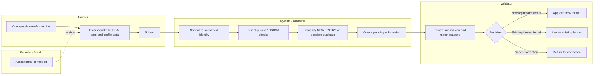
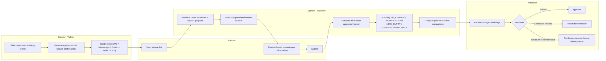
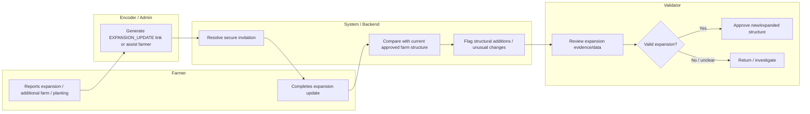
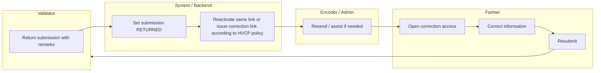

# Farmer Profiling Swimlane Diagram

This document shows the finalized V1 operational flow across the main actors: Farmer, Encoder/Admin, System/Backend, and Validator.

## Swimlane — New farmer



### Result

If approved as new:

```text
Pending submission
   ↓
Canonical farmer_id
   ↓
Farm record(s)
   ↓
First approved Profiling_Round
```

A public respondent must never see candidate farmer records or another farmer's PII.

---

## Swimlane — Existing farmer annual profiling



### Result

```text
2026 approved profiling
      remains unchanged

2027 approved profiling
      becomes a new time-series record

2028 approved profiling
      becomes another new record
```

The annual flow does not overwrite previous approved profiling observations.

---

## Swimlane — Expansion update



Expansion is a new dated structural/profile event, not a silent overwrite of the previous annual observation.

---

## Swimlane — Returned submission



---

## Responsibility summary

| Actor | Main responsibilities |
|---|---|
| Farmer | Provide current and accurate profiling information; use public intake if new or personalized link if existing |
| Encoder | Assist farmers who cannot complete profiling independently; encode on behalf of farmer using staff access |
| Data Administrator | Generate/revoke links if authorized, manage operational access/reference data, handle protected corrections/merges |
| System / Backend | Resolve secure links, enforce scope, preserve history, compare prior/current data, flag duplicates/changes/anomalies |
| Validator | Confirm legitimacy, review flagged changes, approve/return submissions, confirm expansions, route identity issues |

## Security boundaries

- Public new-farmer link never exposes existing farmer data.
- Existing-farmer link resolves server-side to exactly one farmer and profiling purpose.
- The URL should use an opaque random token, not a visible farmer ID as authorization.
- Token status, expiry, revocation, and submission state are enforced server-side.
- Anomaly flags assist human review; they do not automatically reject a submission.
- Previous approved yearly records are immutable historical observations except through an explicit audited correction process.
